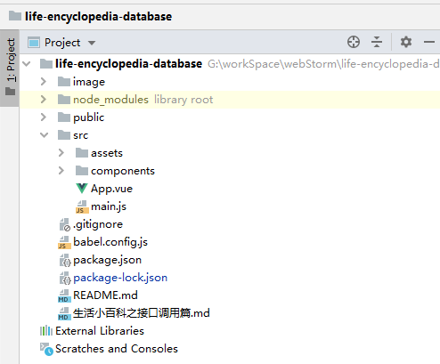

# 导学篇

​        你好呀，同学！我是本次课程的老师草君，欢迎打卡本次课程 —— 《我的生活小百科资料库》。

​         生活中，我们离不开成语接龙，星座匹配，开场笑话等百科技能，但又不能全部知晓，经常性的需要找度娘帮忙。虽然度娘很伟大，几乎有求必应，但我们还是需要自力更生，逐渐从度娘的怀抱中走出。搭建自己的生活小百科资料库，成语释义自己查，星座姻缘自己牵，热场笑话自个整。

​        到这里，你是否好奇生活小百科与接口调用有啥联系？难不成接口的调用可以获取到这些生活百科吗？是的，你没想错，咱们这节课的内容就是通过调用接口，获取生活百科的资料，整合资料，构建咱们自己的资料库。

​         通过本课程的学习，你可以掌握以下知识和技能

> 1.  vue 调用接口的方式
> 2.  掌握 axios 调用接口
> 3.  掌握 ajax 调用接口
> 4.  掌握 vue-resource 调用接口
> 5.  掌握 vue-router 路由的跳转
> 6.  掌握 vue 组件transition的使用

​       为了保证学习本课程的效果，你需要一些简单的知识储备：

> - 了解 html，css，js 的基本知识
> - node环境配置
> - vue项目的搭建
> - 熟悉Hbuilder 或 VSS 或 webstorm工具的基本使用
> - 聚合数据账号

​       准备好了就让我们开始吧！

# 第一关——接口入门：axios

### 1.1 学习目标

​		通过axios请求聚合数据的成语词典api， 根据word查询成语

### 1.2 搭建环境

1. 创建vue项目  **life-encyclopedia-database**， 并用IDE工具打开，如下

   

2. 引入axios依赖并注册为全局对象

   - 安装依赖

   ```
   npm install axios
   ```

   

   - 注册为全局依赖 (修改 src/main.js)

   ```
   import Vue from 'vue'
   import App from './App.vue'
   
   Vue.config.productionTip = false
   
   # 引入Axios
   import Axios from "axios";
   Vue.prototype.Axios = Axios
   
   new Vue({
     render: h => h(App),
   }).$mount('#app')
   ```

1. 编写代码： 修改App.vue内容

   

2. s 