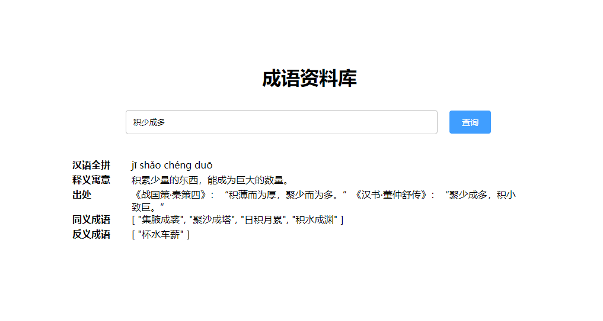
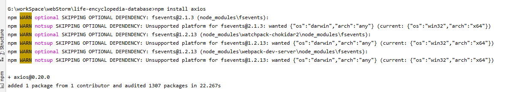
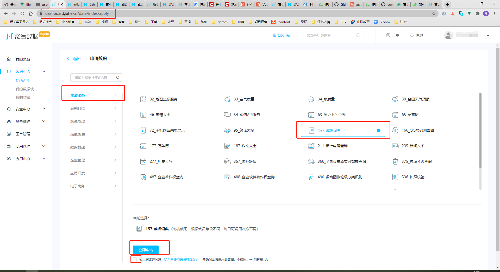
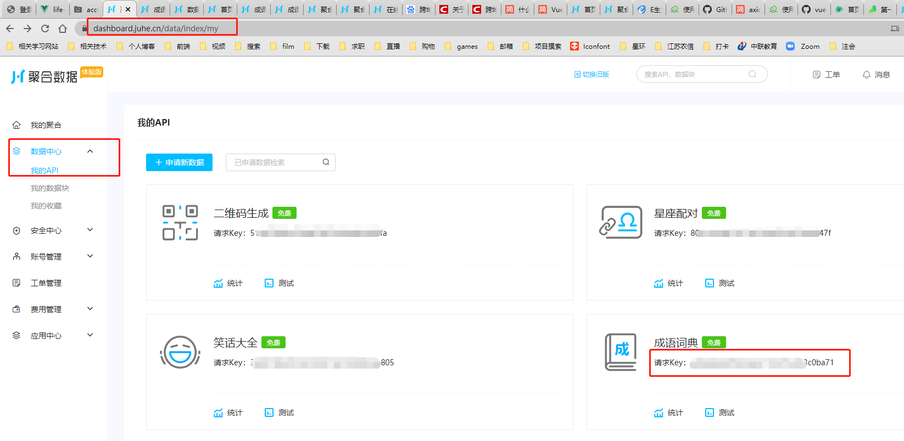
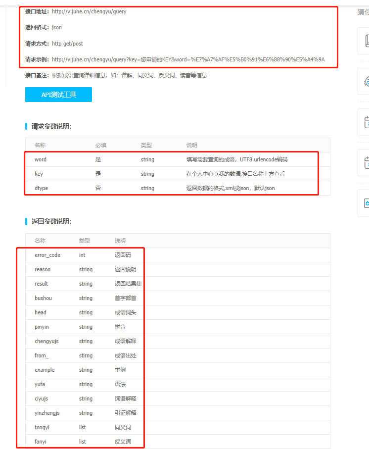
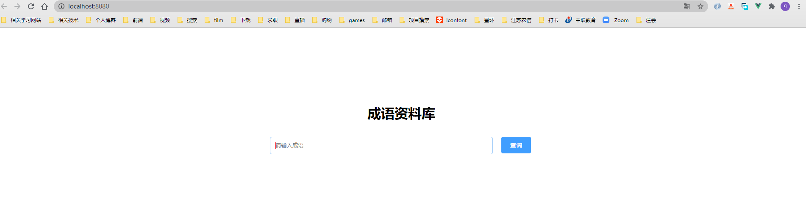

阳光活泼的同学，你好啊(*^▽^*)

我是本次课程的讲师，草君，你可以称呼我为大草。

接下来的时间里由大草带着你学习——【vue的接口请求，vue-router与transition过渡】


# 导学篇

页面的图形表格需要数据，数据分析需要数据，快递物流也需要数据。那么，数据从哪来呢？静态数据不能满足实时显示，像银行卡余额，支付宝余额宝在你收到一笔钱时，心里都想即刻显示出来，这时就需要异步动态请求数据，实时显示余额。到此处，点出本次课程的第一个要点——vue异步接口请求。

咱们本次课程的异步请求将采用三种方式：axios, ajax, vue-resource。基于三种方式全部学习完，咱们再进一步分析每种方式的优缺点。

第二个要点：vue-router，Vue.js官方的路由插件。传统的页面通过超链接实现跳转，如a标签，javascript中的window对象；然而vue构建的是单页面应用，只有一个页面，咱们看到的页面跳转实际上是组件之间的跳转，此时必须使用vue-router来管理组件，继而进行“页面跳转”。

第三点，vue的页面过渡效果。原先页面标签的过渡使用css动画完成，但vue中的标签实际是虚拟的dom元素，此时最好使用vue官方封装的transition组件。

最后，咱们会基于前三点逐步完成一个简易的项目——**《我的生活小百科资料库》**。


为了保证学习本课程的效果，你需要一些简单的知识储备：

> - 了解 html，css，js 的基本知识及vue的基本语法
> - node环境配置
> - vue项目的搭建
> - 熟悉IDE工具的基本使用
> - 聚合数据账号


# 第一关——vue官方推荐接口：axios

### * 说明

- 课程中所有变量使用形式 为  **${变量内容}**
- 程序的源代码： 

### 1.1 学习目标

通过axios请求聚合数据的成语词典api， 根据成语查询成语释义并对查询结果进行展示，最终页面效果图如下



### 1.2 资料科普

1. **axios**

   - 说明

     > Axios 是一个基于 promise 的 HTTP 库，可以用在浏览器和 node.js 中。

   - 特点

     - 从浏览器中创建 XMLHttpRequests
     - 从 node.js 创建 http 请求
     - 支持 Promise API
     - 拦截请求和响应
     - 转换请求数据和响应数据
     - 取消请求
     - 自动转换 JSON 数据
     - 客户端支持防御 XSRF

   - api教程

     > 公用接口
     
     ```
     axios.request(config)
     	.then(function (response) {
     		# 正常请求的处理操作
     	})
     	.catch(function (error) {
     		# 异常请求的处理， 如 404,500等
     	});
     	
     # 例： post请求
     axios.request({
     	method: 'post',
     	url: /user/12345,
     	data: {
     		firstName: 'Fred',
     		lastName: 'Flintstone'
     	}
     })
     	.then(function (response) {
     		# 正常请求的处理操作
     	})
     	.catch(function (error) {
     		# 异常请求的处理， 如 404,500等
     	});
     ```
     
     
     
     
     > get方法简写请求
     
     ```
     axios.get('/user?ID=12345'})
       .then(function (response) {
       	# 正常请求的处理
         console.log(response);
       })
       .catch(function (error) {
       	# 异常请求的处理， 如 404,500等
         console.log(error);
       });
     ```
     
     > post方法简写请求
     
     ```
     axios.post('/user', {
         firstName: 'Fred',
         lastName: 'Flintstone'
       })
       .then(function (response) {
         console.log(response);
       })
       .catch(function (error) {
         console.log(error);
       });
     ```
     
   - 相关网址

     > github：   https://github.com/axios/axios
     >
     > 中文使用说明：  https://www.kancloud.cn/yunye/axios/234845

2. **聚合数据**

   - 说明

     > 在线提供api接口的网站，可免费调用多种服务的接口

   - 相关网址

     > 官网：        https://www.juhe.cn/
     >
     > 账户api：   https://dashboard.juhe.cn/data/index/my
     >
     > 成语api:      https://www.juhe.cn/docs/api/id/157

3.  **跨域问题**

   - 跨域说明

     > 当前发起请求的域与该请求指向的资源所在的域不一样。这里的域指：协议 + 域名 + 端口号， 如果域相同则是同域。
     >
     > 解决浏览器跨域问题： 1. vue的开发环境可以使用 webpack 提供的 代理 - devServer.proxy 
     >
     > 如果你的前端应用和后端 API 服务器没有运行在同一个主机上 或 前端应用和都断。你需要在开发环境下将 API 请求代理到 API 服务器。可以通过  *.config.js 中的 devServer.proxy 选项来配置。

   - 跨域现象

     > 当前端应用和后端 API 服务器跨域时，则请求获取不到接口的值，并报错 
     >
     > Access to XMLHttpRequest at **${后端api接口的域}** from origin **${前端请求的域}** has been blocked by CORS policy: No 'Access-Control-Allow-Origin' header is present on the requested resource.

   - 解决跨域

     > 1.  **vue项目的开发环境 **可以使用 **webpack** 提供的 代理 - **devServer.proxy** 
     > 2. **vue项目的生产环境** 可以使用 **nginx** 提供的代理
     > 3. 后台程序允许跨域请求

### 1.3 搭建环境

1. 创建vue项目  **life-encyclopedia-database**， 并用IDE(Hbuilder 或 VSS 或 webstorm等)工具打开，老师后面将以webstorm作为演示

2. 引入axios依赖

   ```
   npm install axios
   ```

   

3. 创建组件及配置文件

   > 使用axios接口的组件： src/views/Idiom.vue
   >
   > 存放聚合数据api接口所需key的配置文件：  src/config/juhe-key.js
   >
   > devServer.proxy 所需的配置文件： vue.config.js

4.  申请 聚合数据 - 成语词典api 的使用

   申请网址： https://dashboard.juhe.cn/data/index/apply

   

   

### 1.4  代码编写

#### 1.4.1 获取 聚合-成语key

- 获取 聚合账号成语api的key：https://dashboard.juhe.cn/data/index/my

  


- 编写配置文件  **src/config/juhe-key.js**

  ```
  export default {
      chengyu: ${聚合账号成语api的key},
  }
  ```

#### 1.4.2 分析成语api

- api地址： https://www.juhe.cn/docs/api/id/157

  

- ​	通过查看api， 可以看到

  > 1. 接口的请求方式接受 http协议的 get/post ，
  >
  > 2. 接口访问地址：  http://v.juhe.cn/chengyu/query 
  > 3. 接口返回值格式：  json 
  > 4. 请求参数：  word ，  key ，  dtype 
  > 5. 接口返回值

#### 1.4.3 开发环境的代理配置

- 编写配置文件 **vue.config.js**

  ```
  module.exports = {
      devServer: {
          open: true,                                 // 启动程序自动打开页面
          proxy: {                                    // 设置代理
              // 代理 localhost:8080/chengyu/.. 到 http://v.juhe.cn/chengyu/..
              '/chengyu': {                           
                  target: 'http://v.juhe.cn/',
              },
          }
      },
  }
  ```

#### 1.4.4 成语接口的调用及数据展示

- 代码编写思路

  > 1. 输入框 输入待查询的成语
  > 2. 查询按钮 触发点击事件
  > 3. 根据成语 调用 接口 获取成语释义 
  > 4. 将获取到的成语释义 赋值给 变量 value
  > 5. 页面根据value值展示 成语的释义
  
- 编写 src/views/Idiom.vue

  ```
  <template>
      <div style="padding-top: 150px">
          <h1 class="headline">成语资料库</h1>
          <div class="search_condition">
              <input v-model="param" placeholder="请输入成语"/>
              <button style="margin-left: 20px" @click="queryIdiom">查询</button>
          </div>
          <div class="search_result" v-show="Object.keys(value).length > 0">
              <div class="idiom-box" v-for="property in properties" :key="property.column">
                  <div class="idiom-param">
                      <strong>{{property.title}}</strong>
                  </div>
                  <div class="idiom-param-explain">
                      <span>{{value[property.column]}}</span>
                  </div>
              </div>
          </div>
      </div>
  </template>
  
  <script>
      // 引入Axios
      import Axios from "axios";
      // 引入聚合数据的成语api所需的key
      import key from '../config/juhe-key'
  
      export default {
          name: "Idiom",
          data() {
              return {
                  properties: [{
                      title: '汉语全拼',
                      column: 'pinyin'
                  }, {
                      title: '释义寓意',
                      column: 'chengyujs'
                  }, {
                      title: '出处',
                      column: 'from_'
                  }, {
                      title: '同义成语',
                      column: 'tongyi'
                  }, {
                      title: '反义成语',
                      column: 'fanyi'
                  }],
                  param: '',
                  value: {}
              }
          },
          methods: {
              // 查询成语
              queryIdiom() {
                  // 聚合数据的请求接口: http://v.juhe.cn/chengyu/query
                  Axios.get(`/chengyu/query?key=${key.chengyu}&word=${this.param}`)
                  .then( response => {
                      if (response.data.error_code === 0) {
                          this.value = response.data.result
                      } else {
                          console.error("成语查询失败", response.data)
                          alert("查询成语出错： 错误信息: " + response.data.reason)
                      }
                  })
                  .catch( error => {
                      console.error("成语查询失败", error.response)
                      alert("查询成语出错： 错误信息: " + error.response.data)
                  })
              }
          }
      }
  </script>
  
  <style scoped>
      .headline {
          text-align: center;
          padding-bottom: 10px
      }
      .search_condition {
          line-height: 45px;
          width: 620px;
          padding-left: calc((100% - 620px)/2)
      }
      .search_result {
          width: 800px;
          padding-left: calc((100% - 800px)/2);
          padding-top: 40px
      }
  
      input {
          outline: none;                          /** 去除选中时边框样式 */
          caret-color: red;                       /** 修改光标颜色 */
          border: 1px solid #C3C3C3;              /** 修改表框颜色及粗细 */
          padding: 7px 12px;
          height: 25px;
          border-radius: 5px;
          width: 500px;
      }
      input:focus {
          border-color: #95c6f8;
      }
  
      button {
          border: 1px solid #409eff;
          background: #409eff;
          color: #ffffff;
          cursor: pointer;
          font-size: 14px;
          border-radius: 4px;
          padding: 9px 20px;
      }
      button:hover {
          background: #62b0ff;
          border-color: #62b0ff;
      }
  
      .idiom-box {
          clear: both;
          height: 25px
      }
      .idiom-param {
          width: 100px;
          float: left
      }
      .idiom-param-explain {
          width: 700px;
          float: left
      }
  </style>
  ```

#### 1.4.5 修改默认启动组件

- 修改组件：src/App.vue

  ```
  <template>
      <div>
          <Idiom></Idiom>
      </div>
  </template>
  
  <script>
  
  import Idiom from "./views/Idiom";
  
  export default {
      name: 'App',
      components: {
          Idiom
      }
  }
  </script>
  
  <style>
  </style>
  
  ```

#### 1.4.6 启动程序

访问 localhost:8080,  页面展示如下



### 1.5 闯关练习

1.  axios的特点有哪些 ？

   答案：

   > - 从浏览器中创建 XMLHttpRequests
   > - 从 node.js 创建 http 请求
   > - 支持 Promise API
   > - 拦截请求和响应
   > - 转换请求数据和响应数据
   > - 取消请求
   > - 自动转换 JSON 数据
   > - 客户端支持防御 XSRF